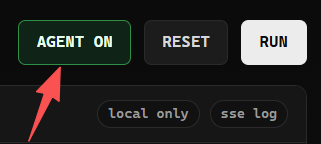

# How to Use With LLM?

## **LLM-assisted AUTO**

需要开启参数 `agent = True` 和 `auto = True`，（也可选和 `webui = True` 一起打开）此时就算不是 Webui，也可以释放 LLM 配合 PureWaf 产生的新能力！

使用这个模式的时候，你需要在你的当前文件的目录创建 `.env` 文件：

```bash
API_KEY=your_api_key
BASE_URL=https://your-openai-api/v1
MODEL=your-model
```

（目前应该是只支持 OpenAI，后面看看多点选择）

随后便将自己需要分析的 PHP 文件放进一个专有文件夹：`/pure` （也是当前目录，无论是单文件还是多文件）

当启动 PureWaf 的时候，会读取 `.env` 和 `/pure` ，如果都存在的话就可以进行分析

（如果是 Webui 的模式，多文件只需要上传一个压缩文件，单文件扔进框里即可）

LLM 的工作流是：

**先分析所给代码中的 sink / 漏洞点 -> 调用 PureWaf 所对应的触发器 -> PureWaf 生成 payload -> PHP CLI 临时沙箱验证 payload -> LLM 结合验证结果复核 payload -> 给出结果**

若 PureWaf 无法给出正确的 payload，此时将由 LLM 自行给出 payload，结果将同步显示到终端

预想来看，若 PureWaf 已经能给出正确的 payload，那相比较于完全交给 LLM 分析，成本会是更低的

（LLM 应不会自行生成 `.env` 和 `/pure` 以及其他任何文件 ）

**在 Webui 中打开 Agent **

```python
from PureWaf import purewaf

def main():
    purewaf(
        webui=True
    )


if __name__ == "__main__":
    main()
```

然后：




## CHANGELOG

### 2026/5/4

初始化 Agent，提供了部分功能，但未能完善
